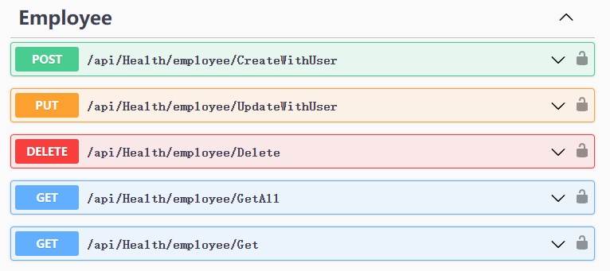
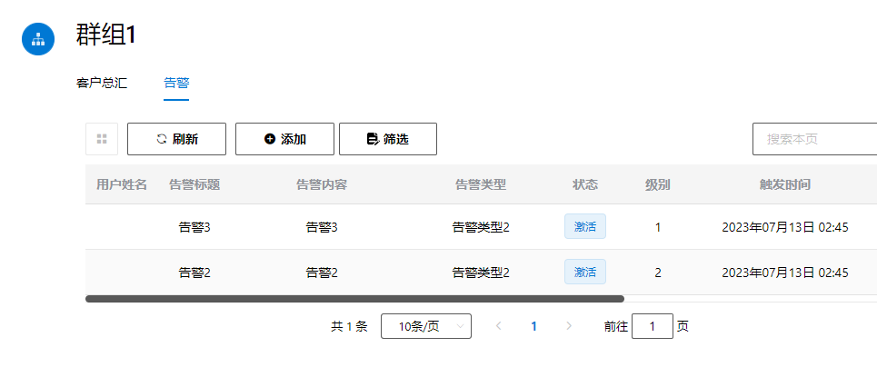

项目地址

volo.abp：http://192.168.1.190:30010/linzhongxiaosheng/general-curd-sample

vue：http://192.168.1.190:30010/linzhongxiaosheng/general-curd-sample-frontend

在线演示：

https://www.matoapp.net:3012/  用户名admin 密码1q2w3E*

目录

- [项目搭建](#项目搭建)
  - [创建项目](#创建项目)
  - [创建业务模块](#创建业务模块)
  - [配置引用和依赖](#配置引用和依赖)
  - [配置DbContext](#配置dbcontext)
  - [创建实体和Dto](#创建实体和dto)
  - [配置AutoMapper](#配置automapper)
- [扩展身份管理模块](#扩展身份管理模块)
  - [用户关系管理](#用户关系管理)
  - [扩展组织管理功能](#扩展组织管理功能)
  - [实现控制器](#实现控制器)
  - [测试接口：](#测试接口)
- [业务用户的增删查改](#业务用户的增删查改)
  - [创建业务用户同步器](#创建业务用户同步器)
  - [创建业务用户应用服务](#创建业务用户应用服务)
    - [增](#增)
    - [删](#删)
    - [改](#改)
    - [查](#查)
  - [创建控制器](#创建控制器)
  - [测试](#测试)
    - [按组织架构查询](#按组织架构查询)
    - [按职称查询](#按职称查询)
- [创建通用查询基类](#创建通用查询基类)
  - [创建通用查询抽象层](#创建通用查询抽象层)
  - [创建通用查询应用层基类](#创建通用查询应用层基类)
  - [创建通用查询控制器基类](#创建通用查询控制器基类)
  - [\[可选\]替换RESTfulApi](#可选替换restfulapi)
  - [扩展泛型参数](#扩展泛型参数)
  - [服务的“渐进式”](#服务的渐进式)
  - [使用](#使用)
- [按组织架构查询](#按组织架构查询-1)
  - [原理](#原理)
  - [实现](#实现)
  - [使用](#使用-1)
  - [测试](#测试-1)
- [按任意字段关键字查询](#按任意字段关键字查询)
  - [实现](#实现-1)
  - [应用](#应用)
  - [测试](#测试-2)
- [按用户查询](#按用户查询)
  - [实现](#实现-2)
  - [使用](#使用-2)
  - [测试](#测试-3)
- [按用户关系查询](#按用户关系查询)
  - [原理](#原理-1)
  - [实现](#实现-3)
    - [正向用户关系](#正向用户关系)
    - [反向用户关系](#反向用户关系)
  - [使用](#使用-3)
  - [测试](#测试-4)
- [按日期范围查询](#按日期范围查询)
  - [实现](#实现-4)
    - [按开始日期查询](#按开始日期查询)
    - [按结束日期查询](#按结束日期查询)
  - [使用](#使用-4)
  - [项目地址](#项目地址)


# 项目搭建

## 创建项目

创建空白文件夹，在文件夹内打开命令行


使用AbpCli创建一个无UI的项目 拆分Auth Server，执行以下命令

```
abp new Matoapp -u none --separate-auth-server -csf
```

等待项目创建成功


## 创建业务模块


作为命名空间前缀，Matoapp是一个虚构的企业名称。

在解决方案目录中创建新目录`src/modules`，在该目录下创建员工健康管理模块Health，公共业务模块Common，以及扩展了Volo.Abp.Indentity的Identity模块


在modules目录下打开命令行，分别执行以下命令

```
abp new Matoapp.Health -t module --no-ui
abp new Matoapp.Common -t module --no-ui
abp new Matoapp.Identity -t module --no-ui
```
等待模块创建完成


打开解决方案，将业务模块中的各个项目添加到解决方案中，我们只需要添加各模块的`Application`，`Application.Contracts`，`Domain`，`Domain.Shared`，`EntityFrameworkCore`，`HttpApi`以及`HttpApi.Client`。

添加完成后的解决方案结构看上去像这样：


## 配置引用和依赖

将`Volo.Abp.Identity.Application`添加到Application项目的引用中

```
dotnet add package Volo.Abp.Identity.Application
```

将`Volo.Abp.Identity.Application.Contracts`添加到Application.Contracts项目的引用中

```
dotnet add package Volo.Abp.Identity.Application.Contracts
```


将`Volo.Abp.Identity.Domain`,`Volo.Abp.PermissionManagement.Domain`添加到Domain项目的引用中

```
dotnet add package Volo.Abp.Identity.Domain
dotnet add package Volo.Abp.PermissionManagement.Domain
```

将`Volo.Abp.Identity.EntityFrameworkCore`添加到EntityFrameworkCore项目的引用中

```
dotnet add package Volo.Abp.Identity.EntityFrameworkCore
```

Application层

Application层添加对各模块的引用，
ApplicationModule中添加对各模块的依赖

```
[DependsOn(
    ...
    typeof(CommonApplicationModule),
    typeof(HealthApplicationModule),
    typeof(IdentityApplicationModule)
    )]
public class MatoappApplicationModule : AbpModule
{

}
```

AuthServer添加Identity数据访问层引用，并配置依赖关系

```
[DependsOn(
    ...
    typeof(IdentityDomainModule),
    typeof(IdentityEntityFrameworkCoreModule)
)]
public class MatoappAuthServerModule : AbpModule
{

}
```

HttpApi层添加对各模块的引用，
HttpApiModule中添加对各模块的依赖


[DependsOn(
    ...
    typeof(CommonHttpApiModule),
    typeof(HealthHttpApiModule),
    typeof(IdentityHttpApiModule)
    )]
public class MatoappHttpApiModule : AbpModule
{

}

## 配置DbContext


用CodeFirst方式创建一些业务表，比如员工表，客户表，报警表等，这些表都是在Health模块中创建的，

Tag相关的表放入Common模块中，Relation表放入Identity模块中。

这些业务表按照业务模块的划分，放入各自的DbContext中。

```
public interface IIdentityDbContext : IEfCoreDbContext
{

    DbSet<Relation.Relation> Relation { get; set; }

}
```

```
public interface IHealthDbContext : IEfCoreDbContext
{

    DbSet<Client.Client> Client { get; set; }
    DbSet<Employee.Employee> Employee { get; set; }

    DbSet<Alarm.Alarm> Alarm { get; set; }

    DbSet<SimpleValueRecord> SimpleValueRecord { get; set; }
}
```

```
public interface ICommonDbContext : IEfCoreDbContext
{
    DbSet<DataEnum.DataEnum> DataEnum { get; set; }
    DbSet<DataEnumCategory.DataEnumCategory> DataEnumCategory { get; set; }
    DbSet<Tag.Tag> Tag { get; set; }
}
```

各业务模块的DbContextModelCreatingExtensions中添加对各表的字段，约束，索引等的配置。以便在DbContext的OnModelCreating中调用

```
builder.ConfigureCommon();
builder.ConfigureHealth();
builder.ConfigureMatoIdentity();

```
EntityFrameworkCore层中改写MatoappDbContext如下：

```
[ReplaceDbContext(typeof(Matoapp.Identity.EntityFrameworkCore.IIdentityDbContext))]
[ReplaceDbContext(typeof(IHealthDbContext))]
[ReplaceDbContext(typeof(ICommonDbContext))]
[ReplaceDbContext(typeof(ITenantManagementDbContext))]
[ConnectionStringName("Default")]
public class MatoappDbContext :
    AbpDbContext<MatoappDbContext>,
    Matoapp.Identity.EntityFrameworkCore.IIdentityDbContext,
    IHealthDbContext,
    ICommonDbContext,
    ITenantManagementDbContext
{

    #region Entities from the modules

    public DbSet<Relation> Relation { get; set; }

    // Tenant Management
    public DbSet<Tenant> Tenants { get; set; }
    public DbSet<TenantConnectionString> TenantConnectionStrings { get; set; }

    public DbSet<Client> Client { get; set; }
    public DbSet<Employee> Employee { get; set; }

    public DbSet<Alarm> Alarm { get; set; }

    public DbSet<SimpleValueRecord> SimpleValueRecord { get; set; }

    public DbSet<DataEnum> DataEnum { get; set; }
    public DbSet<DataEnumCategory> DataEnumCategory { get; set; }
    public DbSet<Tag> Tag { get; set; }


    #endregion

    public MatoappDbContext(DbContextOptions<MatoappDbContext> options)
        : base(options)
    {

    }

    protected override void OnModelCreating(ModelBuilder builder)
    {
        base.OnModelCreating(builder);

        /* Include modules to your migration db context */

        builder.ConfigurePermissionManagement();
        builder.ConfigureSettingManagement();
        builder.ConfigureBackgroundJobs();
        builder.ConfigureAuditLogging();
        builder.ConfigureIdentity();
        builder.ConfigureOpenIddict();
        builder.ConfigureFeatureManagement();
        builder.ConfigureTenantManagement();

        builder.ConfigureCommon();
        builder.ConfigureHealth();
        builder.ConfigureMatoIdentity();

        /* Configure your own tables/entities inside here */

        //builder.Entity<YourEntity>(b =>
        //{
        //    b.ToTable(MatoappConsts.DbTablePrefix + "YourEntities", MatoappConsts.DbSchema);
        //    b.ConfigureByConvention(); //auto configure for the base class props
        //    //...
        //});
    }
}

```


在AuthServer创建AuthServerDbContextFactory，AuthServerDbContext。

AuthServerDbContext.cs代码如下

```
public class AuthServerDbContext : AbpDbContext<AuthServerDbContext>
{
    public AuthServerDbContext(DbContextOptions<AuthServerDbContext> options) 
        : base(options)
    {

    }

    protected override void OnModelCreating(ModelBuilder modelBuilder)
    {
        base.OnModelCreating(modelBuilder);
        modelBuilder.ConfigureIdentity();
        modelBuilder.ConfigureIdentityServer();
        modelBuilder.ConfigureAuditLogging();
        modelBuilder.ConfigurePermissionManagement();
        modelBuilder.ConfigureSettingManagement();
        modelBuilder.ConfigureTenantManagement();
        modelBuilder.ConfigureFeatureManagement();
        modelBuilder.ConfigureMatoIdentity();

    }
}
```

## 创建实体和Dto

在各业务模块中创建实体类，以及对应的Dto类
此处以Health模块为例，创建以下实体类

* Employee 员工
* Client 客户
* Alarm 报警
* SimpleValueRecord 简单值记录


## 配置AutoMapper

根据实际业务需求，配置AutoMapper，将实体类映射到DTO类。此处以Health模块为例。

```
public HealthApplicationAutoMapperProfile()
{
    CreateMap<Client.Client, ClientDto>().Ignore(c => c.EntityVersion);
    CreateMap<Employee.Employee, EmployeeDto>().Ignore(c => c.EntityVersion);

    CreateMap<ClientDto, Client.Client>();
    CreateMap<EmployeeDto, Employee.Employee>();

    CreateMap<Alarm.Alarm, AlarmDto>();
    CreateMap<Alarm.Alarm, AlarmBriefDto>();

    CreateMap<AlarmDto, Alarm.Alarm>().Ignore(c => c.TenantId)
            .Ignore(c => c.ConcurrencyStamp);
    CreateMap<CreateAlarmInput, Alarm.Alarm>().IgnoreFullAuditedObjectProperties()
            .IgnoreSoftDeleteProperties()
            .Ignore(c => c.TenantId)
            .Ignore(c => c.User)
            .Ignore(c => c.ConcurrencyStamp)
            .Ignore(c => c.Id);

    CreateMap<UpdateAlarmInput, Alarm.Alarm>().IgnoreFullAuditedObjectProperties()
            .IgnoreSoftDeleteProperties()
            .Ignore(c => c.TenantId)
            .Ignore(c => c.User)
            .Ignore(c => c.ConcurrencyStamp);

    

    CreateMap<SimpleValueRecord, SimpleValueRecordBriefDto>();
    CreateMap<SimpleValueRecord, SimpleValueRecordDto>();
    CreateMap<SimpleValueRecordDto, SimpleValueRecord>().Ignore(c => c.TenantId)
        .Ignore(c => c.Alarm)
            .Ignore(c => c.ConcurrencyStamp);


    CreateMap<CreateClientInput, Client.Client>()
        .ForAllMembers(opt => opt.Condition((src, dest, srcMember, destMember) => srcMember != null));

    CreateMap<CreateClientWithUserInput, Client.Client>()
        .IgnoreFullAuditedObjectProperties()
        .IgnoreSoftDeleteProperties()
        .Ignore(c => c.LockoutEnabled)
        .Ignore(c => c.LockoutEnd)
        .Ignore(c => c.TenantId)
        .Ignore(c => c.ConcurrencyStamp)
        .Ignore(c => c.EmailConfirmed)
        .Ignore(c => c.PhoneNumberConfirmed)

        .Ignore(c => c.Id)
        .ForAllMembers(opt => opt.Condition((src, dest, srcMember, destMember) => srcMember != null));


    CreateMap<CreateEmployeeInput, Employee.Employee>()
        .ForAllMembers(opt => opt.Condition((src, dest, srcMember, destMember) => srcMember != null));

    CreateMap<CreateEmployeeWithUserInput, Employee.Employee>()

        .IgnoreFullAuditedObjectProperties()
        .IgnoreSoftDeleteProperties()
        .Ignore(c => c.LockoutEnabled)
        .Ignore(c => c.LockoutEnd)
        .Ignore(c => c.TenantId)
        .Ignore(c => c.ConcurrencyStamp)
        .Ignore(c => c.EmailConfirmed)
        .Ignore(c => c.PhoneNumberConfirmed)

        .Ignore(c => c.Id)
        .ForAllMembers(opt => opt.Condition((src, dest, srcMember, destMember) => srcMember != null));
}
```

至此，我们有了基础的数据库，实体类，Dto类。下一步我们将创建Curd应用服务，以及统一查询接口。

# 扩展身份管理模块


身份管理模块（Identity模块）为通用查询接口的按组织架构查询和按户关系查询提供查询依据。

身份管理模块的领域层依赖Volo.Abp.Identity.Domain


Abp为我们实现了一套身份管理模块，此模块包含用户管理、角色管理、组织管理、权限管理等功能。详细请参考[身份管理模块](https://docs.abp.io/zh-Hans/abp/latest/Modules/Identity)。

我们将基于Volo.Abp.Identity模块按需求扩展。将为其扩展组织管理功能的接口，以及人员关系（Relation）功能。

## 用户关系管理

Relation是人员之间的关系，比如：签约、关注，或者朋友关系等。人员之间的关系是单项的，也就是说可以A是B的好友，但B不一定是A的好友。

关系类型由Type来定义

正向关系：User -> RelatedUser，由查询GetRelatedToUsersAsync实现；

反向关系：RelatedUser -> User，由查询GetRelatedFromUsersAsync实现。

添加Relation实体：

```
public class Relation : FullAuditedAggregateRoot<long>
{
    public Guid? TenantId { get; set; }

    [Key, DatabaseGenerated(DatabaseGeneratedOption.Identity)]
    public override long Id { get; protected set; }

    public Guid UserId { get; set; }

    [ForeignKey("UserId")]
    public IdentityUser User { get; set; }

    public Guid RelatedUserId { get; set; }

    [ForeignKey("RelatedUserId")]
    public IdentityUser RelatedUser { get; set; }

    public string Type { get; set; }

}
```

在模块配置中添加

```
public class IdentityEntityFrameworkCoreModule : AbpModule
{
    public override void ConfigureServices(ServiceConfigurationContext context)
    {
        context.Services.AddAbpDbContext<IdentityDbContext>(options =>
        {
            options.AddRepository<IdentityUserOrganizationUnit, EfCoreRepository<IdentityDbContext, IdentityUserOrganizationUnit>>();
            options.AddRepository<Relation.Relation, EfCoreRepository<IdentityDbContext, Relation.Relation>>();
        });
    }
}

```

创建RelationManager，实现人员关系的正向和反向查询


```
public async Task<List<Relation>> GetRelatedToUsersAsync(Guid userId, string type)
{
    var query = (await Repository.GetQueryableAsync())
        .WhereIf(userId != null, c => userId == c.UserId)
        .WhereIf(!string.IsNullOrEmpty(type), c => c.Type == type);
    var items = query.ToList();
    return items;

}

public async Task<List<Relation>> GetRelatedFromUsersAsync(Guid userId, string type)
{
    var query = (await Repository.GetQueryableAsync())
        .Where(c => userId == c.RelatedUserId)
        .WhereIf(!string.IsNullOrEmpty(type), c => c.Type == type);
    var items = query.ToList();
    return items;
}
```

## 扩展组织管理功能

组织（OrganizationUnit）是身份管理模块的核心概念，组织是树形结构，组织之间存在父子关系。

我们对功能模块的接口进行扩展：

1. 增加OrganizationUnit的增删查改接口

2. 增加OrganizationUnit的移动接口

3. 增加人员与组织架构管理接口，如添加/删除人员到组织架构，查询组织架构下的人员，查询未分配组织的人员等

4. 增加查询根组织（GetRootOrganizationUnit）接口。

完整的应用层接口如下：

```
public interface IOrganizationUnitAppService : IBasicCurdAppService<OrganizationUnitDto, Guid, CreateOrganizationUnitInput, UpdateOrganizationUnitInput>, IApplicationService
{
    Task AddToOrganizationUnitAsync(UserToOrganizationUnitInput input);
    Task<List<OrganizationUnitDto>> GetCurrentOrganizationUnitsAsync();
    Task<PagedResultDto<IdentityUserDto>> GetOrganizationUnitUsersByPageAsync(GetOrganizationUnitUsersInput input);
    Task<List<IdentityUserDto>> GetOrganizationUnitUsersAsync(GetOrganizationUnitUsersInput input);
    Task<OrganizationUnitDto> GetRootOrganizationUnitAsync(Guid id);
    Task<List<OrganizationUnitDto>> GetRootOrganizationUnitsAsync(IEnumerable<Guid> ids);
    Task<OrganizationUnitDto> GetRootOrganizationUnitByDisplayNameAsync(GetRootOrganizationUnitByDisplayName input);
    Task<List<OrganizationUnitDto>> GetRootOrganizationUnitsByParentAsync(GetRootOrganizationUnitsByParentInput input);
    Task<bool> IsInOrganizationUnitAsync(UserToOrganizationUnitInput input);
    Task MoveOrganizationUnitAsync(MoveOrganizationUnitInput input);
    Task RemoveUserFromOrganizationUnitAsync(UserToOrganizationUnitInput input);
    Task<List<IdentityUserDto>> GetUsersWithoutOrganizationAsync(GetUserWithoutOrganizationInput input);
    Task<PagedResultDto<IdentityUserDto>> GetUsersWithoutOrganizationByPageAsync(GetUserWithoutOrganizationInput input);
}
```

创建可查询仓储

通用查询接口过滤条件需要对IQueryable进行拼接，由于Volo.Abp.Identity.IIdentityUserRepository继承自IBasicRepository，我们需要重新编写一个IdentityUser的可查询仓储：QueryableIdentityUserRepository

其实现接口IQueryableIdentityUserRepository的定义如下：

```
public interface IQueryableIdentityUserRepository : IIdentityUserRepository
{
    Task<IQueryable<OrganizationUnit>> GetOrganizationUnitsQueryableAsync(Guid id, bool includeDetails = false);
    Task<IQueryable<IdentityUser>> GetOrganizationUnitUsersAsync(
        Guid id, string keyword, string[] type,
        bool includeDetails = false);
    Task<IQueryable<IdentityUser>> GetUsersWithoutOrganizationAsync(string keyword, string[] type);
}
```


## 实现控制器

为OrganizationUnitAppService 以及 RelationAppService 创建。

```
namespace Matoapp.Identity.OrganizationUnit
{
    [Area(IdentityRemoteServiceConsts.ModuleName)]
    [RemoteService(Name = IdentityRemoteServiceConsts.RemoteServiceName)]
    [Route("api/identity/organizationUnit")]
    public class OrganizationUnitController : IdentityController, IOrganizationUnitAppService
    {
        private readonly IOrganizationUnitAppService _organizationUnitAppService;

        public OrganizationUnitController(IOrganizationUnitAppService organizationUnitAppService)
        {
            _organizationUnitAppService = organizationUnitAppService;
        }

        [HttpPost]
        [Route("AddToOrganizationUnit")]
        
        public async Task AddToOrganizationUnitAsync(UserToOrganizationUnitInput input)
        {
            await _organizationUnitAppService.AddToOrganizationUnitAsync(input);
        }

        [HttpPost]
        [Route("Create")]
        
        public async Task<OrganizationUnitDto> CreateAsync(CreateOrganizationUnitInput input)
        {
            return await _organizationUnitAppService.CreateAsync(input);
        }

        [HttpDelete]
        [Route("Delete")]
        
        public async Task DeleteAsync(Guid id)
        {
            await _organizationUnitAppService.DeleteAsync(id);
        }


        [HttpGet]
        [Route("Get")]
        
        public async Task<OrganizationUnitDto> GetAsync(Guid id)
        {
            return await _organizationUnitAppService.GetAsync(id);

        }

        [HttpGet]
        [Route("GetCurrentOrganizationUnits")]

        
        public async Task<List<OrganizationUnitDto>> GetCurrentOrganizationUnitsAsync()
        {
            return await _organizationUnitAppService.GetCurrentOrganizationUnitsAsync();
        }


        [HttpGet]
        [Route("GetOrganizationUnitUsers")]
        
        public async Task<List<IdentityUserDto>> GetOrganizationUnitUsersAsync(GetOrganizationUnitUsersInput input)
        {
            return await _organizationUnitAppService.GetOrganizationUnitUsersAsync(input);
        }

        [HttpGet]
        [Route("GetOrganizationUnitUsersByPage")]
        
        public async Task<PagedResultDto<IdentityUserDto>> GetOrganizationUnitUsersByPageAsync(GetOrganizationUnitUsersInput input)
        {
            return await _organizationUnitAppService.GetOrganizationUnitUsersByPageAsync(input);
        }

        [HttpGet]
        [Route("GetRootOrganizationUnit")]
        
        public async Task<OrganizationUnitDto> GetRootOrganizationUnitAsync(Guid id)
        {
            return await _organizationUnitAppService.GetRootOrganizationUnitAsync(id);
        }

        [HttpGet]
        [Route("GetRootOrganizationUnits")]
        
        public async Task<List<OrganizationUnitDto>> GetRootOrganizationUnitsAsync(IEnumerable<Guid> ids)
        {
            return await _organizationUnitAppService.GetRootOrganizationUnitsAsync(ids);
        }

        [HttpGet]
        [Route("GetRootOrganizationUnitByDisplayName")]
        
        public async Task<OrganizationUnitDto> GetRootOrganizationUnitByDisplayNameAsync(GetRootOrganizationUnitByDisplayName input)
        {
            return await _organizationUnitAppService.GetRootOrganizationUnitByDisplayNameAsync(input);
        }

        [HttpGet]
        [Route("GetRootOrganizationUnitsByParent")]
        
        public async Task<List<OrganizationUnitDto>> GetRootOrganizationUnitsByParentAsync(GetRootOrganizationUnitsByParentInput input)
        {
            return await _organizationUnitAppService.GetRootOrganizationUnitsByParentAsync(input);
        }

        [HttpGet]
        [Route("GetUsersWithoutOrganization")]
        
        public async Task<List<IdentityUserDto>> GetUsersWithoutOrganizationAsync(GetUserWithoutOrganizationInput input)
        {
            return await _organizationUnitAppService.GetUsersWithoutOrganizationAsync(input);
        }

        [HttpGet]
        [Route("GetUsersWithoutOrganizationByPage")]
        
        public async Task<PagedResultDto<IdentityUserDto>> GetUsersWithoutOrganizationByPageAsync(GetUserWithoutOrganizationInput input)
        {
            return await _organizationUnitAppService.GetUsersWithoutOrganizationByPageAsync(input);
        }

        [HttpGet]
        [Route("IsInOrganizationUnit")]
        
        public async Task<bool> IsInOrganizationUnitAsync(UserToOrganizationUnitInput input)
        {
            return await _organizationUnitAppService.IsInOrganizationUnitAsync(input);
        }

        [HttpPost]
        [Route("MoveOrganizationUnit")]
        
        public async Task MoveOrganizationUnitAsync(MoveOrganizationUnitInput input)
        {
            await _organizationUnitAppService.MoveOrganizationUnitAsync(input);
        }

        [HttpPost]
        [Route("RemoveUserFromOrganizationUnit")]
        
        public async Task RemoveUserFromOrganizationUnitAsync(UserToOrganizationUnitInput input)
        {
            await _organizationUnitAppService.RemoveUserFromOrganizationUnitAsync(input);
        }

        [HttpPut]
        [Route("Update")]
        
        public async Task<OrganizationUnitDto> UpdateAsync(UpdateOrganizationUnitInput input)
        {
            return await _organizationUnitAppService.UpdateAsync(input);
        }

    }
```

## 测试接口：

上一章节我们已经将三个模组的依赖添加到MatoappHttpApiModule中，直接启动HttpApi.Host就可以访问接口了。

```
[DependsOn(
    ...
    typeof(CommonHttpApiModule),
    typeof(HealthHttpApiModule),
    typeof(IdentityHttpApiModule)
    )]
public class MatoappHttpApiModule : AbpModule
```
Relation相关接口：


OrganizationUnit相关接口：


# 业务用户的增删查改

区别于身份管理模块（Identity模块）的鉴权用户IdentityUser，业务用户（BusinessUser）是围绕业务系统中“用户”这一定义的领域模型。如：在一个医院系统中，业务用户可以是医生、护士、患者；在一个OA系统中，业务用户可以是员工、管理员、客户等。

业务用户和鉴权用户由同步机制关联，业务用户通过分布式事件（DistributedEvent）的同步器（Synchronizer）与鉴权用户关联同步。

在Health业务模块中，定义两种业务用户：

Client: 客户；

Employee: 员工。

这些业务用户继承自HealthUser，HealthUser是业务用户的基类，包含了业务用户的基本信息，如姓名，性别，出生日期，身份证号等。并且需要实现IUpdateUserData接口，以便在同步鉴权用户信息时，更新业务用户的基本信息。

Employee包含工号，职称，简介等信息。其领域模型定义如下：

```
public class Employee : HealthUser<Guid>, IUser, IUpdateUserData
{
    [StringLength(12)]
    public string EmployeeNumber { get; set; }

    [StringLength(64)]
    public string EmployeeTitle { get; set; }

    public string Introduction { get; set; }

    ...
}

```

Client包含客户号，身高，体重，婚姻状况等信息。其领域模型定义如下：

```
public class Client : HealthUser<Guid>, IUser, IUpdateUserData
{

    //unique

    [StringLength(12)]
    public string ClientNumber { get; set; }

    public string ClientNumberType { get; set; }

    [Range(0.0, 250.0)]
    public double? Height { get; set; }


    [Range(0.0, 1000.0)]
    public double? Weight { get; set; }

    public string Marriage { get; set; }

    public string Status { get; set; }
}

```

## 创建业务用户同步器

以Client为例，ClientLookupService是业务用户的查询服务，其基类UserLookupService定义了关联用户的查询接口，包括按ID查询，按用户名查询，按组织架构查询，按户关系查询等。

创建ClientLookupService， 代码如下

```
public class ClientLookupService : UserLookupService<Client, IClientRepository>, IClientLookupService
{
    public ClientLookupService(
        IClientRepository userRepository,
        IUnitOfWorkManager unitOfWorkManager)
        : base(
            userRepository,
            unitOfWorkManager)
    {

    }

    protected override Client CreateUser(IUserData externalUser)
    {
        return new Client(externalUser);
    }
}

```

同步器订阅了分布式事件EntityUpdatedEto<UserEto>，当鉴权用户更新时，同步器将更新业务用户的基本信息。

创建ClientSynchronizer，代码如下

```
public class ClientSynchronizer :
        IDistributedEventHandler<EntityUpdatedEto<UserEto>>,
    ITransientDependency
{
    protected IClientRepository UserRepository { get; }
    protected IClientLookupService UserLookupService { get; }

    public ClientSynchronizer(
        IClientRepository userRepository,
        IClientLookupService userLookupService)
    {
        UserRepository = userRepository;
        UserLookupService = userLookupService;
    }

    public async Task HandleEventAsync(EntityUpdatedEto<UserEto> eventData)
    {
        var user = await UserRepository.FindAsync(eventData.Entity.Id);
        if (user != null)
        {
            if (user.Update(eventData.Entity))
            {
                await UserRepository.UpdateAsync(user);
            }
        }
    }
}
```

## 创建业务用户应用服务

以Employee为例

在应用层中创建EmployeeAppService，在这里我们实现对业务用户的增删改查操作。

EmployeeAppService继承自CrudAppService，它是ABP框架提供的增删改查的基类，其基类定义了增删改查的接口，包括GetAsync，GetListAsync，CreateAsync，UpdateAsync，DeleteAsync等。


OrganizationUnit为业务用户的查询接口的按组织架构查询提供查询依据。OrganizationUnitAppService注入到EmployeeAppService中。

```
public class EmployeeAppService : CrudAppService<Employee, EmployeeDto, Guid, GetAllEmployeeInput, CreateEmployeeInput>, IEmployeeAppService
{
    private readonly IOrganizationUnitAppService organizationUnitAppService;

}
```

### 增

创建CreateWithUserAsync方法，用于创建业务用户。

```
public async Task<EmployeeDto> CreateWithUserAsync(CreateEmployeeWithUserInput input)
{

    var createdUser = await identityUserAppService.CreateAsync(input);
    await CurrentUnitOfWork.SaveChangesAsync();
    var currentEmployee = await userLookupService.FindByIdAsync(createdUser.Id);
    ObjectMapper.Map(input, currentEmployee);
    var updatedEmployee = await Repository.UpdateAsync(currentEmployee);
    var result = ObjectMapper.Map<Employee, EmployeeDto>(updatedEmployee);

    if (input.OrganizationUnitId.HasValue)
    {
        await organizationUnitAppService.AddToOrganizationUnitAsync(
            new UserToOrganizationUnitInput()
            { UserId = createdUser.Id, OrganizationUnitId = input.OrganizationUnitId.Value });
    }
    return result;
}
```

### 删

删除接口由CrudAppService提供默认实现，无需重写。

### 改

创建UpdateWithUserAsync方法，用于更新业务用户。

```
public async Task<EmployeeDto> UpdateWithUserAsync(CreateEmployeeInput input)
{

    var currentEmployee = await userLookupService.FindByIdAsync(input.Id);
    if (currentEmployee == null)
    {
        throw new UserFriendlyException("没有找到对应的用户");
    }
    ObjectMapper.Map(input, currentEmployee);
    var updatedEmployee = await Repository.UpdateAsync(currentEmployee);
    var result = ObjectMapper.Map<Employee, EmployeeDto>(updatedEmployee);

    return result;
}

```


### 查

查询单个实体接口由CrudAppService提供默认实现，无需重写。

查询集合：

以Employee为例，查询接口所需要的入参为：

OrganizationUnitId：按组织架构查询用户
IsWithoutOrganization：查询不属于任何组织架构的用户
EmployeeTitle：按职称查询用户


创建GetAllEmployeeInput，代码如下

```
public class GetAllEmployeeInput : PagedAndSortedResultRequestDto
{
    public string EmployeeTitle { get; set; }

    public Guid? OrganizationUnitId { get; set; }
    public bool IsWithoutOrganization { get; set; }

}
```

重写CreateFilteredQueryAsync

```

protected override async Task<IQueryable<Employee>> CreateFilteredQueryAsync(GetAllEmployeeInput input)
{
    var query = await ReadOnlyRepository.GetQueryableAsync().ConfigureAwait(continueOnCapturedContext: false);

    if (input.OrganizationUnitId.HasValue && !input.IsWithoutOrganization)
    {
        var organizationUnitUsers = await organizationUnitAppService.GetOrganizationUnitUsersAsync(new GetOrganizationUnitUsersInput()
        {
            Id = input.OrganizationUnitId.Value
        });
        if (organizationUnitUsers.Count() > 0)
        {
            var ids = organizationUnitUsers.Select(c => c.Id);
            query = query.Where(t => ids.Contains(t.Id));
        }
        else
        {
            query = query.Where(c => false);
        }
    }
    else if (input.IsWithoutOrganization)
    {
        var organizationUnitUsers = await organizationUnitAppService.GetUsersWithoutOrganizationAsync(new GetUserWithoutOrganizationInput());
        if (organizationUnitUsers.Count() > 0)
        {
            var ids = organizationUnitUsers.Select(c => c.Id);
            query = query.Where(t => ids.Contains(t.Id));
        }
        else
        {
            query = query.Where(c => false);
        }
    }
    query = query.WhereIf(!string.IsNullOrEmpty(input.EmployeeTitle), c => c.EmployeeTitle == input.EmployeeTitle);
    return query;
}

```

至此，我们已完成了对业务用户的增删改查功能实现。

## 创建控制器

在HttpApi项目中创建EmployeeController，代码如下：

```
[Area(HealthRemoteServiceConsts.ModuleName)]
[RemoteService(Name = HealthRemoteServiceConsts.RemoteServiceName)]
[Route("api/Health/employee")]
public class EmployeeController : AbpControllerBase, IEmployeeAppService
{
    private readonly IEmployeeAppService _employeeAppService;

    public EmployeeController(IEmployeeAppService employeeAppService)
    {
        _employeeAppService = employeeAppService;
    }

    [HttpPost]
    [Route("CreateWithUser")]

    public Task<EmployeeDto> CreateWithUserAsync(CreateEmployeeWithUserInput input)
    {
        return _employeeAppService.CreateWithUserAsync(input);
    }

    [HttpDelete]
    [Route("Delete")]
    public Task DeleteAsync(Guid id)
    {
        return _employeeAppService.DeleteAsync(id);
    }

    [HttpPut]
    [Route("UpdateWithUser")]

    public Task<EmployeeDto> UpdateWithUserAsync(CreateEmployeeInput input)
    {
        return _employeeAppService.UpdateWithUserAsync(input);
    }

    [HttpGet]
    [Route("Get")]
    public Task<EmployeeDto> GetAsync(Guid id)
    {
        return _employeeAppService.GetAsync(id);
    }

    [HttpGet]
    [Route("GetAll")]
    public Task<PagedResultDto<EmployeeDto>> GetAllAsync(GetAllEmployeeInput input)
    {
        return _employeeAppService.GetAllAsync(input);
    }
}
```


## 测试


运行项目




在Web端，进入组织机构

我们随意创建几个部门，如下图所示：


创建几个员工用户，并将他们分配到“研发组A”，“研发组B”中，


### 按组织架构查询

通过点击不同的组织架构，可以查看不同的用户：

“研发组A”中的用户：


“研发组B”中的用户：


“未分配”中的用户：


### 按职称查询

在某个组别中点击“筛选”，选择职称-中级，点击查询

将查询所有职称为中级的员工


组合查询的报文Payload如下图：


# 创建通用查询基类

我们将封装通用的应用层，接口以及控制器基类。

## 创建通用查询抽象层

创建接口ICurdAppService，在这里我们定义了通用的增删改查接口。

其中的泛型参数：

* TGetOutputDto： Get方法返回的实体Dto
* TGetListOutputDto:  GetAll方法返回的实体Dto
* TKey: 实体的主键
* TGetListInput: GetAll方法接收的输入参数
* TCreateInput: Create方法接收的输入参数
* TUpdateInput: Update方法接收的输入参数


```
public interface ICurdAppService<TGetOutputDto, TGetListOutputDto, in TKey, in TGetListInput, in TCreateInput, in TUpdateInput>

{
    Task<TGetOutputDto> GetAsync(TKey id);

    Task<PagedResultDto<TGetListOutputDto>> GetAllAsync(TGetListInput input);

    Task<TGetOutputDto> CreateAsync(TCreateInput input);

    Task<TGetOutputDto> UpdateAsync(TUpdateInput input);

    Task DeleteAsync(TKey id);
}

```

## 创建通用查询应用层基类


创建应用层服务CurdAppServiceBase，它是一个抽象类，继承自Abp.Application.Services.CrudAppService。

代码如下：


```
public abstract class CurdAppServiceBase<TEntity, TGetOutputDto, TGetListOutputDto,  TKey, TGetListInput,  TCreateInput, TUpdateInput>
: CrudAppService<TEntity, TGetOutputDto, TGetListOutputDto, TKey, TGetListInput, TCreateInput, TUpdateInput>
where TEntity : class, IEntity<TKey>
    where TGetOutputDto : IEntityDto<TKey>
where TGetListOutputDto : IEntityDto<TKey>
{
    protected CurdAppServiceBase(IRepository<TEntity, TKey> repository)
: base(repository)
    {

    }
}
```

## 创建通用查询控制器基类

创建控制器类CurdController，继承自AbpControllerBase。并实现ICurdAppService接口。

代码如下：

```
public abstract class CurdController<ITAppService, TGetOutputDto, TGetListOutputDto,  TKey, TGetListInput,  TCreateInput, TUpdateInput>
    : AbpControllerBase
where ITAppService : ICurdAppService<TGetOutputDto, TGetListOutputDto,  TKey, TGetListInput,  TCreateInput, TUpdateInput>
where TGetOutputDto : IEntityDto<TKey>
where TGetListOutputDto : IEntityDto<TKey>
{

    private readonly ITAppService _recipeAppService;

    public CurdController(ITAppService recipeAppService)
    {
        _recipeAppService = recipeAppService;
    }

    [HttpPost]
    [Route("Create")]
    
    public virtual async Task<TGetOutputDto> CreateAsync(TCreateInput input)
    {
        return await _recipeAppService.CreateAsync(input);
    }

    [HttpDelete]
    [Route("Delete")]
    
    public virtual async Task DeleteAsync(TKey id)
    {
        await _recipeAppService.DeleteAsync(id);
    }

    [HttpGet]
    [Route("GetAll")]
    
    public virtual async Task<PagedResultDto<TGetListOutputDto>> GetAllAsync(TGetListInput input)
    {
        return await _recipeAppService.GetAllAsync(input);
    }

    [HttpGet]
    [Route("Get")]
    
    public virtual async Task<TGetOutputDto> GetAsync(TKey id)
    {
        return await _recipeAppService.GetAsync(id);
    }

    [HttpPut]
    [Route("Update")]
    
    public virtual async Task<TGetOutputDto> UpdateAsync(TUpdateInput input)
    {
        return await _recipeAppService.UpdateAsync(input);
    }
}
```


## [可选]替换RESTfulApi

为了兼容旧版Abp，需更改增删查改服务（CrudAppService）的方法签名，可参考[[Volo.Abp升级笔记]使用旧版Api规则替换RESTful Api以兼容老程序](https://blog.csdn.net/jevonsflash/article/details/129756995)，此处不再赘述。

将UpdateAsync，GetListAsync方法封闭：

```
private new Task<TGetOutputDto> UpdateAsync(TKey id, TUpdateInput input)
{
    return base.UpdateAsync(id, input);
}
private new Task<PagedResultDto<TGetListOutputDto>> GetListAsync(TGetListInput input)
{
    return base.GetListAsync(input);
}


```

封闭原有UpdateAsync， 新增的UpdateAsync方法更改了方法签名：
```

public virtual async Task<TGetOutputDto> UpdateAsync(TUpdateInput input)
{
    await CheckUpdatePolicyAsync();
    var entity = await GetEntityByIdAsync((input as IEntityDto<TKey>).Id);
    MapToEntity(input, entity);
    await Repository.UpdateAsync(entity, autoSave: true);
    return await MapToGetOutputDtoAsync(entity);

}

```

Brief是一种简化的查询实体集合的方法，其返回的Dto不包含导航属性，以减少数据传输量。

新增GetAllAsync和GetAllBriefAsync方法：

```
public virtual Task<PagedResultDto<TGetListOutputDto>> GetAllAsync(TGetListInput input)
{
    return this.GetListAsync(input);
}


public async Task<PagedResultDto<TGetListBriefOutputDto>> GetAllBriefAsync(TGetListBriefInput input)
{
    await CheckGetListPolicyAsync();

    var query = await CreateBriefFilteredQueryAsync(input);
    var totalCount = await AsyncExecuter.CountAsync(query);

    var entities = new List<TEntity>();
    var entityDtos = new List<TGetListBriefOutputDto>();

    if (totalCount > 0)
    {
        query = ApplySorting(query, input);
        query = ApplyPaging(query, input);

        entities = await AsyncExecuter.ToListAsync(query);

        entityDtos = ObjectMapper.Map<List<TEntity>, List<TGetListBriefOutputDto>>(entities);

    }

    return new PagedResultDto<TGetListBriefOutputDto>(
        totalCount,
        entityDtos
    );

}

```


## 扩展泛型参数

目前为止，我们的应用层基类继承于Abp.Application.Services.CrudAppService

为了更好的代码重用，我们对泛型参数进行扩展，使用CurdAppServiceBase的类可根据实际业务需求选择泛型参数

其中的泛型参数：

* TEntity: CRUD操作对应的实体类
* TEntityDto: GetAll方法返回的实体Dto
* TKey: 实体的主键
* TGetListBriefInput: GetAllBrief方法的输入参数
* TGetListBriefOutputDto: GetAllBrief方法的输出参数

首先扩展ICurdAppService：

```

public interface ICurdAppService<TEntityDto, in TKey>
    : ICurdAppService<TEntityDto, TKey, PagedAndSortedResultRequestDto>
{

}

public interface ICurdAppService<TEntityDto, in TKey, in TGetListInput>
    : ICurdAppService<TEntityDto, TKey, TGetListInput, TEntityDto>
{

}

public interface ICurdAppService<TEntityDto, in TKey, in TGetListInput, in TCreateInput>
    : ICurdAppService<TEntityDto, TKey, TGetListInput, TCreateInput, TCreateInput>
{

}


public interface ICurdAppService<TEntityDto, in TKey, in TGetListInput, in TCreateInput, in TUpdateInput>
    : ICurdAppService<TEntityDto, TEntityDto, TKey, TGetListInput, TCreateInput, TUpdateInput>
{

}


public interface ICurdAppService<TGetOutputDto, TGetListOutputDto, in TKey, in TGetListInput, in TCreateInput, in TUpdateInput>
: ICurdAppService<TGetOutputDto,  TGetListOutputDto, TKey, TGetListInput, TGetListInput, TCreateInput, TUpdateInput>
{

}


public interface ICurdAppService<TGetOutputDto, TGetListOutputDto, in TKey, in TGetListInput, in TGetListBriefInput, in TCreateInput, in TUpdateInput>
: ICurdAppService<TGetOutputDto, TGetListOutputDto, TGetListOutputDto, TKey, TGetListInput, TGetListBriefInput, TCreateInput, TUpdateInput>
{

}


public interface ICurdAppService<TGetOutputDto, TGetListOutputDto, TGetListBriefOutputDto, in TKey, in TGetListInput, in TGetListBriefInput, in TCreateInput, in TUpdateInput>

{
    Task<TGetOutputDto> GetAsync(TKey id);

    Task<PagedResultDto<TGetListOutputDto>> GetAllAsync(TGetListInput input);

    Task<TGetOutputDto> CreateAsync(TCreateInput input);

    Task<TGetOutputDto> UpdateAsync(TUpdateInput input);

    Task DeleteAsync(TKey id);

    Task<PagedResultDto<TGetListBriefOutputDto>> GetAllBriefAsync(TGetListInput input);


}


```

扩展CurdAppServiceBase：

```

public abstract class CurdAppServiceBase<TEntity, TEntityDto, TKey>
    : CurdAppServiceBase<TEntity, TEntityDto, TKey, PagedAndSortedResultRequestDto>
    where TEntity : class, IEntity<TKey>
    where TEntityDto : IEntityDto<TKey>
{
    protected CurdAppServiceBase(IRepository<TEntity, TKey> repository)
        : base(repository)
    {

    }
}

public abstract class CurdAppServiceBase<TEntity, TEntityDto, TKey, TGetListInput>
    : CurdAppServiceBase<TEntity, TEntityDto, TKey, TGetListInput, TEntityDto>
    where TEntity : class, IEntity<TKey>
    where TEntityDto : IEntityDto<TKey>
{
    protected CurdAppServiceBase(IRepository<TEntity, TKey> repository)
        : base(repository)
    {

    }
}


public abstract class CurdAppServiceBase<TEntity, TEntityDto, TKey, TGetListInput, TCreateInput>
    : CurdAppServiceBase<TEntity, TEntityDto, TKey, TGetListInput, TCreateInput, TCreateInput>
    where TEntity : class, IEntity<TKey>
    where TEntityDto : IEntityDto<TKey>
{
    protected CurdAppServiceBase(IRepository<TEntity, TKey> repository)
        : base(repository)
    {

    }
}

public abstract class CurdAppServiceBase<TEntity, TEntityDto, TKey, TGetListInput, TCreateInput, TUpdateInput>
: CurdAppServiceBase<TEntity, TEntityDto, TEntityDto, TKey, TGetListInput, TCreateInput, TUpdateInput>
where TEntity : class, IEntity<TKey>
where TEntityDto : IEntityDto<TKey>
{
    protected CurdAppServiceBase(IRepository<TEntity, TKey> repository)
        : base(repository)
    {

    }

    protected override Task<TEntityDto> MapToGetListOutputDtoAsync(TEntity entity)
    {
        return MapToGetOutputDtoAsync(entity);
    }

    protected override TEntityDto MapToGetListOutputDto(TEntity entity)
    {
        return MapToGetOutputDto(entity);
    }
}

public abstract class CurdAppServiceBase<TEntity, TGetOutputDto, TGetListOutputDto, TKey, TGetListInput, TCreateInput, TUpdateInput>
: CurdAppServiceBase<TEntity, TGetOutputDto, TGetListOutputDto, TKey, TGetListInput, TGetListInput, TCreateInput, TUpdateInput>
where TEntity : class, IEntity<TKey>
where TGetOutputDto : IEntityDto<TKey>
where TGetListOutputDto : IEntityDto<TKey>
{
    protected CurdAppServiceBase(IRepository<TEntity, TKey> repository)
        : base(repository)
    {

    }
}


public abstract class CurdAppServiceBase<TEntity, TGetOutputDto, TGetListOutputDto, TKey, TGetListInput,  TCreateInput, TUpdateInput>
: CurdAppServiceBase<TEntity, TGetOutputDto, TGetListOutputDto, TGetListOutputDto, TKey, TGetListInput,  TCreateInput, TUpdateInput>
where TEntity : class, IEntity<TKey>
where TGetOutputDto : IEntityDto<TKey>
where TGetListOutputDto : IEntityDto<TKey>
{
    protected CurdAppServiceBase(IRepository<TEntity, TKey> repository)
        : base(repository)
    {

    }
}

```

扩展CurdController

```
public abstract class CurdController<ITAppService, TEntityDto, TKey>
        : CurdController<ITAppService, TEntityDto, TKey, PagedAndSortedResultRequestDto>
        where ITAppService : ICurdAppService<TEntityDto, TKey>
        where TEntityDto : IEntityDto<TKey>
{
    protected CurdController(ITAppService appService)
        : base(appService)
    {

    }
}

public abstract class CurdController<ITAppService, TEntityDto, TKey, TGetListInput>
    : CurdController<ITAppService, TEntityDto, TKey, TGetListInput, TEntityDto>
    where ITAppService : ICurdAppService<TEntityDto, TKey, TGetListInput>
    where TEntityDto : IEntityDto<TKey>
{
    protected CurdController(ITAppService appService)
        : base(appService)
    {

    }
}


public abstract class CurdController<ITAppService, TEntityDto, TKey, TGetListInput, TCreateInput>
    : CurdController<ITAppService, TEntityDto, TKey, TGetListInput, TCreateInput, TCreateInput>
    where ITAppService : ICurdAppService<TEntityDto, TKey, TGetListInput, TCreateInput>
    where TEntityDto : IEntityDto<TKey>
{
    protected CurdController(ITAppService appService)
        : base(appService)
    {

    }
}


public abstract class CurdController<ITAppService, TEntityDto, TKey, TGetListInput, TCreateInput, TUpdateInput>
: CurdController<ITAppService, TEntityDto, TEntityDto, TKey, TGetListInput, TCreateInput, TUpdateInput>
where ITAppService : ICurdAppService<TEntityDto, TKey, TGetListInput, TCreateInput, TUpdateInput>
    where TEntityDto : IEntityDto<TKey>
{
    protected CurdController(ITAppService appService)
        : base(appService)
    {

    }

}


public abstract class CurdController<ITAppService, TGetOutputDto, TGetListOutputDto, TKey, TGetListInput, TCreateInput, TUpdateInput>
: CurdController<ITAppService, TGetOutputDto, TGetListOutputDto, TKey, TGetListInput, TGetListInput, TCreateInput, TUpdateInput>
where ITAppService : ICurdAppService<TGetOutputDto, TGetListOutputDto, TKey, TGetListInput, TCreateInput, TUpdateInput>
where TGetOutputDto : IEntityDto<TKey>
where TGetListOutputDto : IEntityDto<TKey>
{
    protected CurdController(ITAppService appService)
        : base(appService)
    {

    }

}


public abstract class CurdController<ITAppService, TGetOutputDto, TGetListOutputDto, TKey, TGetListInput, TGetListBriefInput, TCreateInput, TUpdateInput>
: CurdController<ITAppService, TGetOutputDto, TGetListOutputDto, TGetListOutputDto, TKey, TGetListInput, TGetListBriefInput, TCreateInput, TUpdateInput>
where ITAppService : ICurdAppService<TGetOutputDto, TGetListOutputDto, TKey, TGetListInput, TGetListBriefInput, TCreateInput, TUpdateInput>
where TGetOutputDto : IEntityDto<TKey>
where TGetListOutputDto : IEntityDto<TKey>
where TGetListBriefInput : TGetListInput
{
    protected CurdController(ITAppService appService)
        : base(appService)
    {

    }

}


public abstract class CurdController<ITAppService, TGetOutputDto, TGetListOutputDto, TGetListBriefOutputDto, TKey, TGetListInput, TGetListBriefInput, TCreateInput, TUpdateInput>
    : AbpControllerBase
where ITAppService : ICurdAppService<TGetOutputDto, TGetListOutputDto, TGetListBriefOutputDto, TKey, TGetListInput, TGetListBriefInput, TCreateInput, TUpdateInput>
where TGetOutputDto : IEntityDto<TKey>
where TGetListOutputDto : IEntityDto<TKey>
where TGetListBriefInput : TGetListInput
{

    private readonly ITAppService _recipeAppService;

    public CurdController(ITAppService recipeAppService)
    {
        _recipeAppService = recipeAppService;
    }

    [HttpPost]
    [Route("Create")]
    
    public virtual async Task<TGetOutputDto> CreateAsync(TCreateInput input)
    {
        return await _recipeAppService.CreateAsync(input);
    }

    [HttpDelete]
    [Route("Delete")]
    
    public virtual async Task DeleteAsync(TKey id)
    {
        await _recipeAppService.DeleteAsync(id);
    }

    [HttpGet]
    [Route("GetAll")]
    
    public virtual async Task<PagedResultDto<TGetListOutputDto>> GetAllAsync(TGetListInput input)
    {
        return await _recipeAppService.GetAllAsync(input);
    }

    [HttpGet]
    [Route("Get")]
    
    public virtual async Task<TGetOutputDto> GetAsync(TKey id)
    {
        return await _recipeAppService.GetAsync(id);
    }

    [HttpPut]
    [Route("Update")]
    
    public virtual async Task<TGetOutputDto> UpdateAsync(TUpdateInput input)
    {
        return await _recipeAppService.UpdateAsync(input);
    }

    [HttpGet]
    [Route("GetAllBrief")]
    
    public virtual async Task<PagedResultDto<TGetListBriefOutputDto>> GetAllBriefAsync(TGetListBriefInput input)
    {
        return await _recipeAppService.GetAllBriefAsync(input);
    }
}


```

## 服务的“渐进式”

在开发业务模块时，我们可以先使用简单的方式提供Curd服务，随着UI复杂度增加，逐步的使用更加复杂的Curd服务。某种程度上来说，即所谓“渐进式”的开发方式。

* BaseCurd: 基础型，仅包含Create、Update、Delete、Get
* SimpleCurd: 简单型，包含BaseCurd的所有功能，同时包含GetAll
* Curd：完整型，包含SimpleCurd的所有功能，同时包含GetAllBrief，GetAllBrief是一种简化的查询实体集合的方法，其返回的Dto不包含导航属性，以减少数据传输量。是最常用的服务类型。
* ExtendedCurd：扩展型，包含Curd的所有功能，同时包含GetAllBriefWithoutPage，GetAllBriefWithoutPage 适合一些非分页场景，如日历视图，Echarts图表控件等。使用此接口需要注意：由于没有分页限制，需要其他的查询约束条件（比如日期范围），否则会返回大量的数据，影响性能。


我们扩展应用层基类，控制器及其接口


## 使用


以Alarm为例。来实现扩展型Curd服务（ExtendedCurd）。

假设你已完成创建实体、Dto以及配置完成AutoMapper映射


1. 在Health模块的抽象层中，创建接口IAlarmAppService，继承自IExtendedCurdAppService和IApplicationService。

IApplicationService是ABP框架的接口，所有的应用服务都需要继承自此接口。

```
public interface IAlarmAppService : IExtendedCurdAppService<AlarmDto, AlarmDto, AlarmBriefDto, long, GetAllAlarmInput, GetAllAlarmInput,  CreateAlarmInput, UpdateAlarmInput>, IApplicationService
{
}
```


2. 在Health模块的应用层中，创建AlarmAppService


```
public class AlarmAppService : ExtendedCurdAppServiceBase<CAH.Health.Alarm.Alarm, AlarmDto, AlarmDto, AlarmBriefDto, long, GetAllAlarmInput, GetAllAlarmInput, CreateAlarmInput, UpdateAlarmInput>, IAlarmAppService
{
    public AlarmAppService(IRepository<CAH.Health.Alarm.Alarm, long> basicInventoryRepository) : base(basicInventoryRepository)
    {
    }
}

```

3. 在Health模块的HttpApi中，创建AlarmController，并实现IAlarmAppService接口

```
[Area(HealthRemoteServiceConsts.ModuleName)]
[RemoteService(Name = HealthRemoteServiceConsts.RemoteServiceName)]
[Route("api/Health/alarm")]
public class AlarmController : ExtendedCurdController<IAlarmAppService, AlarmDto, AlarmDto, AlarmBriefDto, long, GetAllAlarmInput, GetAllAlarmInput, CreateAlarmInput, UpdateAlarmInput>, IAlarmAppService
{
    private readonly IAlarmAppService _alarmAppService;

    public AlarmController(IAlarmAppService alarmAppService) : base(alarmAppService)
    {
        _alarmAppService = alarmAppService;
    }


}
```


运行程序


可以看到，我们的接口已经包含所有扩展型Curd方法。


# 按组织架构查询

之前我们实现了Employee，Alarm管理模块以及通用查询应用层。

Employee的集合查询业务，是通过重写CreateFilteredQueryAsync方法，来实现按组织架构查询的过滤条件。

我们将这段逻辑代码提取到通用查询应用层中，便可实现在任何业务的按组织架构查询。


## 原理

EmployeeAppService中，CreateFilteredQueryAsync方法组织架构的过滤条件代码如下：

```
var organizationUnitUsers = await organizationUnitAppService.GetOrganizationUnitUsersAsync(new GetOrganizationUnitUsersInput()
{
    Id = input.OrganizationUnitId.Value
});
if (organizationUnitUsers.Count() > 0)
{
    var ids = organizationUnitUsers.Select(c => c.Id);
    query = query.Where(t => ids.Contains(t.Id));
}
else
{
    query = query.Where(c => false);
}
```

CreateFilteredQueryAsync是通过业务用户的IRepository获取实体的IQueryable 然后通过query.Where()实现了按组织架构的过滤条件。

IQueryable是一泛型类接口，泛型参数是实体类。要想在任意实体实现Where的过滤条件，我们使用动态拼接语言集成查询 (LINQ) 的方式实现通用查询接口，有关LINQ表达式，请阅读 [LINQ 教程](https://learn.microsoft.com/zh-cn/dotnet/csharp/programming-guide/concepts/linq)和有关 [Lambda 表达式](https://learn.microsoft.com/zh-cn/dotnet/csharp/language-reference/operators/lambda-expressions)的文章。


## 实现


定义按组织架构查询过滤器（IOrganizationOrientedFilter）接口，查询实体列表Dto若实现该接口，将筛选指定 OrganizationUnitId 下的用户关联的实体。

```
public interface IOrganizationOrientedFilter
{
    Guid? OrganizationUnitId { get; set; }
}
```


重写CreateFilteredQueryAsync方法，代码如下

```

protected override async Task<IQueryable<TEntity>> CreateFilteredQueryAsync(TGetListInput input)
{
    var query = await ReadOnlyRepository.GetQueryableAsync();

    query = await ApplyOrganizationOrientedFiltered(query,input);

    return query;
}
```

对于OrganizationUnit服务，其依赖关系在应用层，查找指定组织架构的用户将在CurdAppServiceBase的子类实现。创建一个抽象方法GetUserIdsByOrganizationAsync

```
protected abstract Task<IEnumerable<Guid>> GetUserIdsByOrganizationAsync(Guid organizationUnitId)
```


创建应用过滤条件方法：ApplyOrganizationOrientedFiltered，在此实现拼接LINQ表达式，代码如下：


```
protected virtual async Task<IQueryable<TEntity>> ApplyOrganizationOrientedFiltered(IQueryable<TEntity> query, TGetListInput input)
{
    if (input is IOrganizationOrientedFilter && HasProperty<TEntity>("UserId"))
    {
        var property = typeof(TEntity).GetProperty("UserId");
        var filteredInput = input as IOrganizationOrientedFilter;
        if (filteredInput != null && filteredInput.OrganizationUnitId.HasValue)
        {

            var ids = await GetUserIdsByOrganizationAsync(filteredInput.OrganizationUnitId.Value);
            Expression originalExpression = null;
            var parameter = Expression.Parameter(typeof(TEntity), "p");
            foreach (var id in ids)
            {
                var keyConstantExpression = Expression.Constant(id, typeof(Guid));
                var propertyAccess = Expression.MakeMemberAccess(parameter, property);
                var expressionSegment = Expression.Equal(propertyAccess, keyConstantExpression);

                if (originalExpression == null)
                {
                    originalExpression = expressionSegment;
                }
                else
                {
                    originalExpression = Expression.Or(originalExpression, expressionSegment);
                }
            }

            var equalExpression = originalExpression != null ?
                    Expression.Lambda<Func<TEntity, bool>>(originalExpression, parameter)
                    : p => false;

            query = query.Where(equalExpression);

        }

    }
    return query;
}
```

请注意，可应用过滤的条件为：

1. input需实现IOrganizationOrientedFilter接口
2. 实体必须包含UserId字段

否则将原封不动返回IQueryable对象。


## 使用

在上一章Alarm管理模块中，我们已经写好了AlarmAppService，我们需要为其实现GetUserIdsByOrganizationAsync方法。改造AlarmAppService代码如下：

```
public class AlarmAppService : ExtendedCurdAppServiceBase<Matoapp.Health.Alarm.Alarm, AlarmDto, AlarmDto, AlarmBriefDto, long, GetAllAlarmInput, GetAllAlarmInput, CreateAlarmInput, UpdateAlarmInput>, IAlarmAppService
{
    private readonly IOrganizationUnitAppService organizationUnitAppService;

    public AlarmAppService(
        IOrganizationUnitAppService organizationUnitAppService,
        IRepository<Matoapp.Health.Alarm.Alarm, long> basicInventoryRepository) : base(basicInventoryRepository)
    {
        this.organizationUnitAppService = organizationUnitAppService;
    }

    protected override async Task<IEnumerable<Guid>> GetUserIdsByOrganizationAsync(Guid organizationUnitId)
    {
        var organizationUnitUsers = await organizationUnitAppService.GetOrganizationUnitUsersAsync(new GetOrganizationUnitUsersInput()
        {
            Id = organizationUnitId
        });

        var ids = organizationUnitUsers.Select(c => c.Id);
        return ids;
    }
}
```

## 测试

创建一些组织架构，命名“群组”


在不同“群组”下创建一些客户（Client）


在告警管理页面中，创建一些告警，并将这些告警分配给不同的客户


在客户管理中，通过选择不同的组织架构，查询当前“群组”下的客户告警




# 按任意字段关键字查询


## 实现

定义按任意字段关键字查询过滤器（IKeywordOrientedFilter）接口，查询实体列表Dto若实现该接口，将筛选指定的目标字段（TargetFields）包含指定的关键字（Keyword）的实体。

```
public interface IKeywordOrientedFilter
{
    public string Keyword { get; set; }

    public string TargetFields { get; set; }
}

```

创建应用过滤条件方法：ApplySearchFiltered，代码如下：

```
protected virtual IQueryable<TEntity> ApplySearchFiltered(IQueryable<TEntity> query, TGetListInput input)
{
    if (input is IKeywordOrientedFilter)
    {
        var filteredInput = input as IKeywordOrientedFilter;
        if (filteredInput != null)
        {
            var targetFields = new string[] { "Name", "Title" };
            if (!string.IsNullOrEmpty(filteredInput.TargetFields))
            {
                targetFields = filteredInput.TargetFields.Split(',');
            }

            return query.WhereIf(!filteredInput.Keyword.IsNullOrWhiteSpace(),
                FilterByKeywordDynamic<TEntity>(filteredInput.Keyword, targetFields));
        }
    }
    return query;
}
```
请注意，可应用过滤的条件为：

1. input需实现IKeywordOrientedFilter接口，且Keyword不为空；
2. 若filteredInput.TargetFields为空，则默认使用Name和Title字段进行筛选。

对于每一个TargetField，需要在实体中找到对应字段（属性）。若找到，则为此实体字段创建条件筛选的表达式，然后将这些表达式通过Or连接起来，最终返回一个包含多段关键字筛选的Lambda表达式。

创建FilterByKeywordDynamic方法，代码如下：
```
private Expression<Func<TEntity, bool>> FilterByKeywordDynamic<T>(string keyword, params string[] sortColumns)
{
    var parameter = Expression.Parameter(typeof(T), "p");
    var propertys = sortColumns.Select(sortColumn => typeof(T).GetProperty(sortColumn));

    var method = typeof(string)
        .GetMethods()
        .FirstOrDefault(x => x.Name == "Contains");

    var keyConstantExpression = Expression.Constant(keyword, typeof(string));
    Expression originalExpression = null;
    foreach (var property in propertys)
    {
        if (property != null)
        {
            var propertyAccess = Expression.MakeMemberAccess(parameter, property);
            var expression = Expression.Call(propertyAccess, method, keyConstantExpression);
            if (originalExpression == null)
            {
                originalExpression = expression;
            }
            else
            {
                originalExpression = Expression.Or(originalExpression, expression);
            }
        }
    }

    var result = originalExpression != null ?
            Expression.Lambda<Func<TEntity, bool>>(originalExpression, parameter)
            : p => true;
    return result;


}

```


创建默认的应用过滤规则DefaultConvention，将之前的按组织架构查询和按关键字查询的代码提取到DefaultConvention方法中，此类可派生，使用virtual关键字以便在子类中重写，代码如下：

```
protected virtual async Task<IQueryable<TEntity>> DefaultConvention(TGetListInput input, IQueryable<TEntity> query)
{
    query = ApplySearchFiltered(query, input);
    query = ApplyUserOrientedFiltered(query, input);
    return query;
}
```

在CreateBriefFilteredQueryAsync和CreateFilteredQueryAsync方法中调用DefaultConvention方法，代码如下：

```
protected virtual async Task<IQueryable<TEntity>> CreateBriefFilteredQueryAsync(TGetListBriefInput input)
{
    var query = await ReadOnlyRepository.GetQueryableAsync();

    query = await DefaultConvention(input, query);

    return query;
}


protected override async Task<IQueryable<TEntity>> CreateFilteredQueryAsync(TGetListInput input)
{
    var query = await ReadOnlyRepository.GetQueryableAsync();

    query = await DefaultConvention(input, query);

    return query;
}


```

## 应用

无需在应用层中更改代码，

在GetAllAlarmInput中实现IKeywordOrientedFilter接口，代码如下：

```
public class GetAllAlarmInput : PagedAndSortedResultRequestDto,   IKeywordOrientedFilter
{
    //keyword
    public string Keyword { get; set; }
    public string TargetFields { get; set; }

    ...
}

```

## 测试


在告警管理页面建立一些告警


在筛选中输入关键字“3”，点击查询


可以看到将筛选出标题包含关键字“3”的告警


查询的报文Payload如下图：


# 按用户查询


## 实现


定义按用户查询（IUserOrientedFilter）接口

```
public interface IUserOrientedFilter
{
    public string EntityUserIdIdiom { get; }
    Guid? UserId { get; set; }
}

```

* EntityUserIdIdiom：语义上的UserId，用于指定业务实体中用于描述“用户Id”字段的名称，若不指定，则默认为“UserId”
* UserId：用户Id，若为Guid.Empty，则使用当前登录用户的Id


查询实体列表Dto若实现该接口，将筛选指定 UserId 下的关联的实体。

若指定 UserId 为 Guid.Empty，则使用当前登录用户的 UserId。

ICurrentUser是Abp的一个服务，用于获取当前登录用户的信息


创建应用过滤条件方法：ApplyUserOrientedFiltered，在此实现拼接LINQ表达式，代码如下：


```
protected virtual IQueryable<TEntity> ApplyUserOrientedFiltered(IQueryable<TEntity> query, TGetListInput input)
{
    if (input is IUserOrientedFilter)
    {
        var filteredInput = input as IUserOrientedFilter;
        var entityUserIdIdiom = filteredInput.EntityUserIdIdiom;
        if (string.IsNullOrEmpty(entityUserIdIdiom))
        {
            entityUserIdIdiom = "UserId";
        }
        if (HasProperty<TEntity>(entityUserIdIdiom))
        {
            var property = typeof(TEntity).GetProperty(entityUserIdIdiom);
            if (filteredInput != null && filteredInput.UserId.HasValue)
            {
                Guid userId = default;
                if (filteredInput.UserId.Value == Guid.Empty)
                {
                    using (var scope = ServiceProvider.CreateScope())
                    {
                        var currentUser = scope.ServiceProvider.GetRequiredService<ICurrentUser>();
                        if (currentUser != null)
                        {
                            userId = currentUser.GetId();
                        }
                    }
                }
                else
                {
                    userId = filteredInput.UserId.Value;
                }

                var parameter = Expression.Parameter(typeof(TEntity), "p");
                var keyConstantExpression = Expression.Constant(userId, typeof(Guid));

                var propertyAccess = Expression.MakeMemberAccess(parameter, property);
                var expression = Expression.Equal(propertyAccess, keyConstantExpression);

                var equalExpression = expression != null ?
                        Expression.Lambda<Func<TEntity, bool>>(expression, parameter)
                        : p => false;

                query = query.Where(equalExpression);
            }
        }
    }
    return query;
}


```

请注意，可应用过滤的条件为：

1. input需实现IUserOrientedFilter接口；
2. 实体必须关联用户。

否则将原封不动返回IQueryable对象。


## 使用

无需在应用层中更改代码，

在GetAllAlarmInput中实现IUserOrientedFilter接口，代码如下：

```
public class GetAllAlarmInput : PagedAndSortedResultRequestDto, IUserOrientedFilter
{
    Guid? UserId { get; set; }
    
    public string EntityUserIdIdiom { get; }      
    // 或显式实现   
    // public string EntityUserIdIdiom => "UserId";
    
    ...
}

```

## 测试

创建一些组织架构，命名“群组”


在不同“群组”下创建一些客户（Client）


在告警管理页面中，创建一些告警，并将这些告警分配给不同的客户


告警创建完成后，进入客户管理，在右侧客户列表中点击“查看详情”

打开客户详情页面，点击“告警”标签页，可以看到该客户下的告警列表


# 按用户关系查询


用户关系（Relation）是描述业务系统中人员与人员之间的关系，如：签约、关注，或者朋友关系。

之前我们在扩展身份管理模块的时候，已经实现了用户关系管理，可以查看本系列博文之前的内容。[怎样优雅地增删查改（二）：扩展身份管理模块](https://blog.csdn.net/jevonsflash/article/details/131602982)

## 原理

**查询依据**

用户之间的关系通过Relation表来存储。模型如下图所示：


* 关系类型由Type来定义

* 关系指向由UserId与RelatedUserId来描述

    人员之间的关系是单项的，也就是说可以A是B的好友，但B不一定是A的好友

    正向关系：User -> RelatedUser

    反向关系：RelatedUser -> User

查询目标业务对象HealthAlarm关联了业务用户HealthClient，因业务用户与鉴权用户IdentityUser共享同一个Id，因此可以通过查询用户关系关联的User，查询到业务对象。


## 实现


### 正向用户关系


定义按正向用户关系查询（IRelationToOrientedFilter）接口

```
public interface IRelationToOrientedFilter
{
    Guid? RelationToUserId { get; set; }
    
    public string EntityUserIdIdiom { get; }

    string RelationType { get; set; }

}

```

* EntityUserIdIdiom：语义上的UserId，用于指定业务实体中用于描述“用户Id”字段的名称，若不指定，则默认为“UserId”；
* RelationToUserId：正向关系用户Id，若为Guid.Empty，则使用当前登录用户的Id；
* RelationType：关系类型，如：“attach”为签约，“follow”为关注，可自定义。


对于Relation服务，其依赖关系在应用层，查找指定用户的关系用户将在CurdAppServiceBase的子类实现。创建一个抽象方法GetUserIdsByRelatedToAsync

```
protected abstruct Task<IEnumerable<Guid>> GetUserIdsByRelatedToAsync(Guid userId, string relationType);
```


创建应用过滤条件方法：ApplyRelationToOrientedFiltered，在此实现拼接LINQ表达式，

ICurrentUser是Abp的一个服务，用于获取当前登录用户的信息

代码如下：


```
protected virtual async Task<IQueryable<TEntity>> ApplyRelationToOrientedFiltered(IQueryable<TEntity> query, TGetListInput input)
{
    if (input is IRelationToOrientedFilter)
    {
        var filteredInput = input as IRelationToOrientedFilter;
        var entityUserIdIdiom = filteredInput.EntityUserIdIdiom;
        if (string.IsNullOrEmpty(entityUserIdIdiom))
        {
            entityUserIdIdiom = "UserId";
        }
        if (HasProperty<TEntity>(entityUserIdIdiom))
        {
            var property = typeof(TEntity).GetProperty(entityUserIdIdiom);
            if (filteredInput != null && filteredInput.RelationToUserId.HasValue && !string.IsNullOrEmpty(filteredInput.RelationType))
            {

                Guid userId = default;
                if (filteredInput.RelationToUserId.Value == Guid.Empty)
                {
                    using (var scope = ServiceProvider.CreateScope())
                    {
                        var currentUser = scope.ServiceProvider.GetRequiredService<ICurrentUser>();
                        if (currentUser != null)
                        {
                            userId = currentUser.GetId();
                        }
                    }
                }
                else
                {
                    userId = filteredInput.RelationToUserId.Value;
                }

                var ids = await GetUserIdsByRelatedToAsync(userId, filteredInput.RelationType);
                Expression originalExpression = null;
                var parameter = Expression.Parameter(typeof(TEntity), "p");
                foreach (var id in ids)
                {
                    var keyConstantExpression = Expression.Constant(id, typeof(Guid));
                    var propertyAccess = Expression.MakeMemberAccess(parameter, property);
                    var expressionSegment = Expression.Equal(propertyAccess, keyConstantExpression);

                    if (originalExpression == null)
                    {
                        originalExpression = expressionSegment;
                    }
                    else
                    {
                        originalExpression = Expression.Or(originalExpression, expressionSegment);
                    }
                }

                var equalExpression = originalExpression != null ?
                        Expression.Lambda<Func<TEntity, bool>>(originalExpression, parameter)
                        : p => false;

                query = query.Where(equalExpression);

            }

        }
    }
    return query;
}


```

### 反向用户关系

定义按反向用户关系查询（IRelationFromOrientedFilter）接口

```
public interface IRelationFromOrientedFilter
{
    Guid? RelationFromUserId { get; set; }
    
    public string EntityUserIdIdiom { get; }

    string RelationType { get; set; }

}

```

* EntityUserIdIdiom：语义上的UserId，用于指定业务实体中用于描述“用户Id”字段的名称，若不指定，则默认为“UserId”；
* RelationFromUserId：反向关系用户Id，若为Guid.Empty，则使用当前登录用户的Id；
* RelationType：关系类型，如：“attach”为签约，“follow”为关注，可自定义。


对于Relation服务，其依赖关系在应用层，查找指定用户的关系用户将在CurdAppServiceBase的子类实现。创建一个抽象方法GetUserIdsByRelatedFromAsync

```
protected abstruct Task<IEnumerable<Guid>> GetUserIdsByRelatedFromAsync(Guid userId, string relationType);
```


创建应用过滤条件方法：ApplyRelationFromOrientedFiltered，在此实现拼接LINQ表达式，

ICurrentUser是Abp的一个服务，用于获取当前登录用户的信息

代码如下：


```
protected virtual async Task<IQueryable<TEntity>> ApplyRelationFromOrientedFiltered(IQueryable<TEntity> query, TGetListInput input)
{
    if (input is IRelationFromOrientedFilter)
    {
        var filteredInput = input as IRelationFromOrientedFilter;
        var entityUserIdIdiom = filteredInput.EntityUserIdIdiom;
        if (string.IsNullOrEmpty(entityUserIdIdiom))
        {
            entityUserIdIdiom = "UserId";
        }
        if (HasProperty<TEntity>(entityUserIdIdiom))
        {
            var property = typeof(TEntity).GetProperty(entityUserIdIdiom);
            if (filteredInput != null && filteredInput.RelationFromUserId.HasValue && !string.IsNullOrEmpty(filteredInput.RelationType))
            {

                Guid userId = default;
                if (filteredInput.RelationFromUserId.Value == Guid.Empty)
                {
                    using (var scope = ServiceProvider.CreateScope())
                    {
                        var currentUser = scope.ServiceProvider.GetRequiredService<ICurrentUser>();
                        if (currentUser != null)
                        {
                            userId = currentUser.GetId();
                        }
                    }
                }
                else
                {
                    userId = filteredInput.RelationFromUserId.Value;
                }

                var ids = await GetUserIdsByRelatedFromAsync(userId, filteredInput.RelationType);
                Expression originalExpression = null;
                var parameter = Expression.Parameter(typeof(TEntity), "p");
                foreach (var id in ids)
                {
                    var keyConstantExpression = Expression.Constant(id, typeof(Guid));
                    var propertyAccess = Expression.MakeMemberAccess(parameter, property);
                    var expressionSegment = Expression.Equal(propertyAccess, keyConstantExpression);

                    if (originalExpression == null)
                    {
                        originalExpression = expressionSegment;
                    }
                    else
                    {
                        originalExpression = Expression.Or(originalExpression, expressionSegment);
                    }
                }

                var equalExpression = originalExpression != null ?
                        Expression.Lambda<Func<TEntity, bool>>(originalExpression, parameter)
                        : p => false;

                query = query.Where(equalExpression);

            }
        }
    }
    return query;
}

```

IRelationToOrientedFilter 和 IRelationFromOrientedFilter接口实现上并非互斥。

请注意，可应用过滤的条件为：

1. input需实现IRelationToOrientedFilter接口；
2. 实体必须关联用户。

否则将原封不动返回IQueryable对象。


## 使用

在应用层中，实现GetUserIdsByRelatedToAsync

```
protected override async Task<IEnumerable<Guid>> GetUserIdsByRelatedToAsync(Guid userId, string relationType)
{
    var ids = await relationAppService.GetRelatedToUserIdsAsync(new GetRelatedUsersInput()
    {
        UserId = userId,
        Type = relationType
    });
    return ids;

}
```

或GetUserIdsByRelatedFromAsync

```
protected override async Task<IEnumerable<Guid>> GetUserIdsByRelatedFromAsync(Guid userId, string relationType)
{
    var ids = await relationAppService.GetRelatedFromUserIdsAsync(new GetRelatedUsersInput()
    {
        UserId = userId,
        Type = relationType
    });
    return ids;

}
```


在GetAllAlarmInput中实现IRelationToOrientedFilter或GetUserIdsByRelatedFromAsync接口，代码如下：

```
public class GetAllAlarmInput : PagedAndSortedResultRequestDto, IRelationToOrientedFilter
{ 
    public Guid? RelationToUserId { get ; set ; }
    public string RelationType { get; set; }
    public string EntityUserIdIdiom { get; }

    ...
}

```


## 测试

创建一些客户（Client）


进入客户管理，在右侧客户列表中点击“查看详情”

打开客户详情页面，点击管理 - 设置签约员工


选择一个用户，此时该客户会签约至该用户账号下，这里我们将客户1和客户3签约至当前账号admin下。


登录签约用户(admin)的账号，点击“我的” - 客户 - 签约客户

在客户列表中可见，客户1和客户3已签约至当前账号下。


组合查询的报文Payload如下图：


# 按日期范围查询

使用数据库的创建时间作为查询依据，在Abp框架中，实体类实现ICreationAuditedObject接口，或继承CreationAuditedEntity类，使用仓储创建记录时将自动生成CreationTime。

## 实现


定义按创建日期范围查询（IDateSpanOrientedFilter）接口。

遵守接口隔离原则，将IDateSpanOrientedFilter接口拆分为IStartDateOrientedFilter和IEndDateOrientedFilter接口。

```
public interface IDateSpanOrientedFilter : IStartDateOrientedFilter, IEndDateOrientedFilter
{

}
```

按开始日期查询接口定义如下：

```
public interface IStartDateOrientedFilter
{
    DateTime? StartDate { get; set; }
}
```

结束日期接口定义如下：
```
public interface IEndDateOrientedFilter
{
    DateTime? EndDate { get; set; }
}
```


* StartDate：开始日期，记录的CreationTime **大于等于** 该日期的记录将被筛选
* EndDate：用户Id，记录的CreationTime **小于** 该日期的记录将被筛选


### 按开始日期查询

创建应用过滤条件方法：ApplyStartDateOrientedFiltered，在此实现拼接LINQ表达式，代码如下：


```
protected virtual IQueryable<TEntity> ApplyStartDateOrientedFiltered(IQueryable<TEntity> query, TGetListInput input)
{
    if (input is IStartDateOrientedFilter && HasProperty<TEntity>("CreationTime"))
    {
        var property = typeof(TEntity).GetProperty("CreationTime");
        var filteredInput = input as IStartDateOrientedFilter;
        if (filteredInput != null && filteredInput.StartDate.HasValue)
        {
            Expression originalExpression = null;
            var parameter = Expression.Parameter(typeof(TEntity), "p");

            var dateConstantExpression = Expression.Constant(filteredInput.StartDate.Value, typeof(DateTime));

            var propertyAccess = Expression.MakeMemberAccess(parameter, property);
            var expression = Expression.GreaterThanOrEqual(propertyAccess, dateConstantExpression);

            var equalExpression = expression != null ?
                    Expression.Lambda<Func<TEntity, bool>>(expression, parameter)
                    : p => false;


            query = query.Where(equalExpression);

        }

    }
    return query;
}


```

### 按结束日期查询

创建应用过滤条件方法：ApplyEndDateOrientedFiltered，在此实现拼接LINQ表达式，代码如下：

```
protected virtual IQueryable<TEntity> ApplyEndDateOrientedFiltered(IQueryable<TEntity> query, TGetListInput input)
{
    if (input is IEndDateOrientedFilter && HasProperty<TEntity>("CreationTime"))
    {
        var property = typeof(TEntity).GetProperty("CreationTime");
        var filteredInput = input as IEndDateOrientedFilter;
        if (filteredInput != null && filteredInput.EndDate.HasValue)
        {
            Expression originalExpression = null;
            var parameter = Expression.Parameter(typeof(TEntity), "p");

            var dateConstantExpression = Expression.Constant(filteredInput.EndDate.Value, typeof(DateTime));

            var propertyAccess = Expression.MakeMemberAccess(parameter, property);
            var expression = Expression.LessThan(propertyAccess, dateConstantExpression);

            var equalExpression = expression != null ?
                    Expression.Lambda<Func<TEntity, bool>>(expression, parameter)
                    : p => false;


            query = query.Where(equalExpression);

        }

    }
    return query;
}
```


请注意，可应用过滤的条件为：

1. input需实现IDateSpanOrientedFilter或子接口；
2. 实体必须包含“CreationTime”字段。

否则将原封不动返回IQueryable对象。


## 使用

无需在应用层中更改代码，

在GetAllAlarmInput中实现IDateSpanOrientedFilter接口，代码如下：

```
public class GetAllAlarmInput : PagedAndSortedResultRequestDto, IDateSpanOrientedFilter
{
    public DateTime? StartDate { get; set; }
    public DateTime? EndDate { get; set; }

    ...
}

```


至此，所有的通用查询接口已实现完成。在这个项目中，我实现了适合我的联合查询方式，你可以根据实际业务需求，扩展和调整查询实现。

## 项目地址

[Github:general-curd-sample](https://github.com/jevonsflash/general-curd-sample)